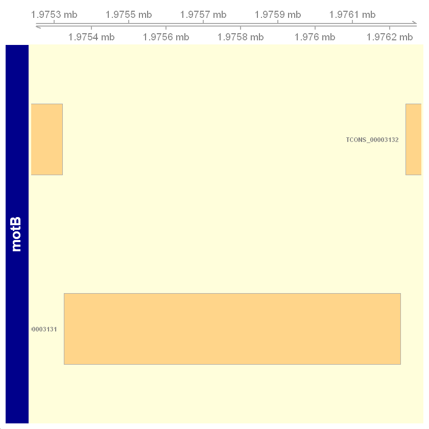
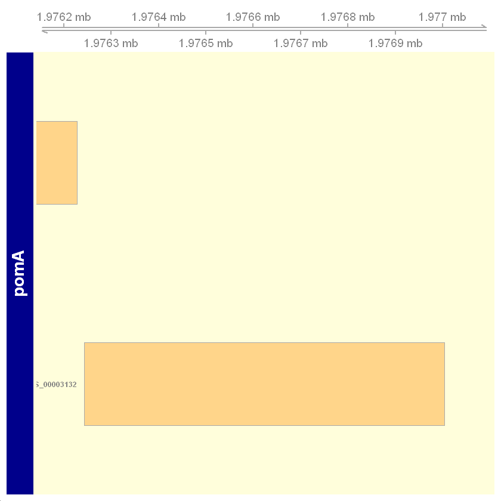
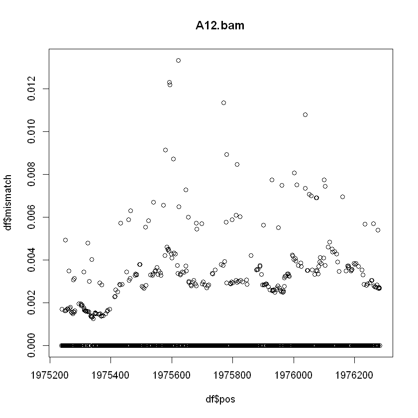
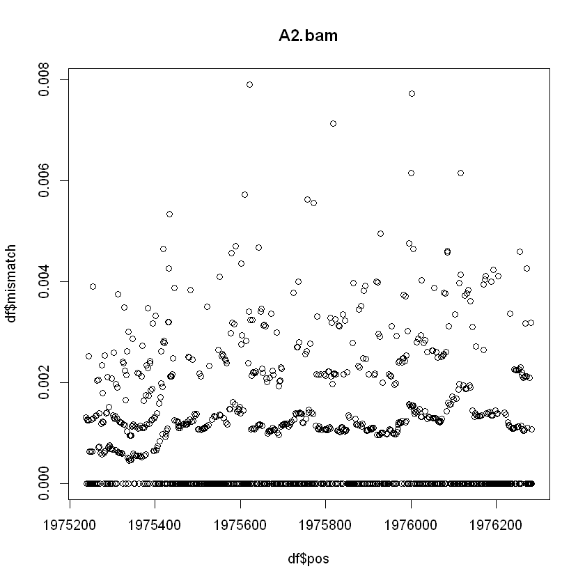
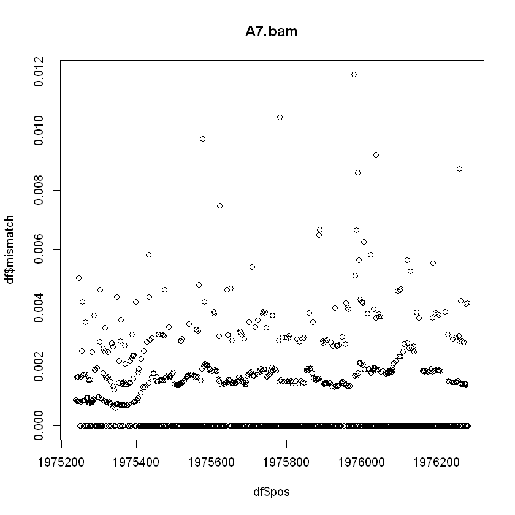
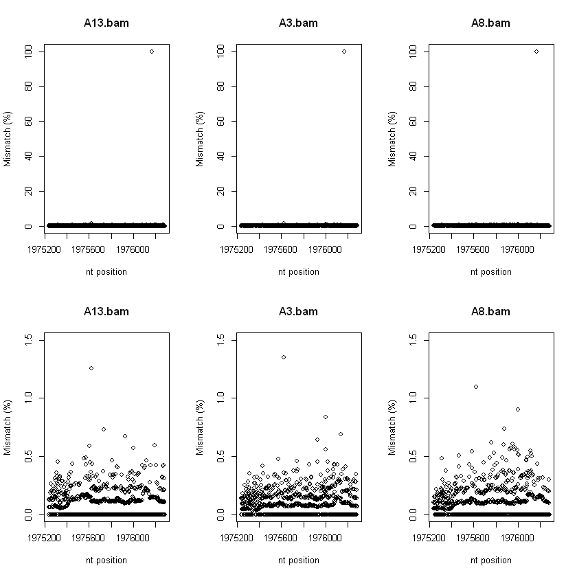
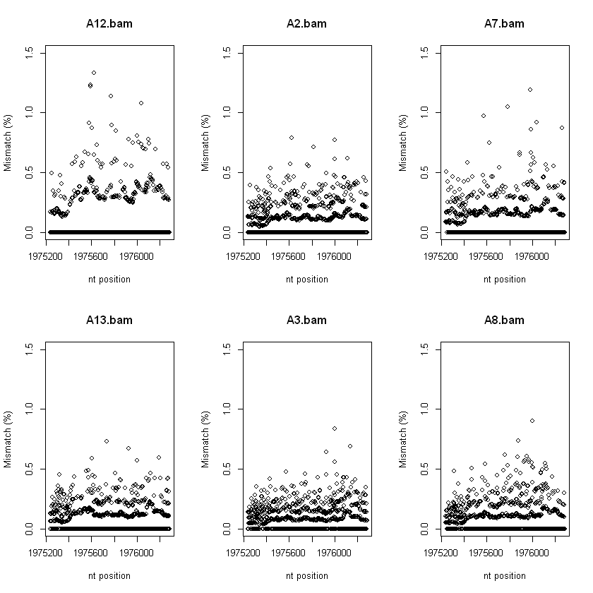
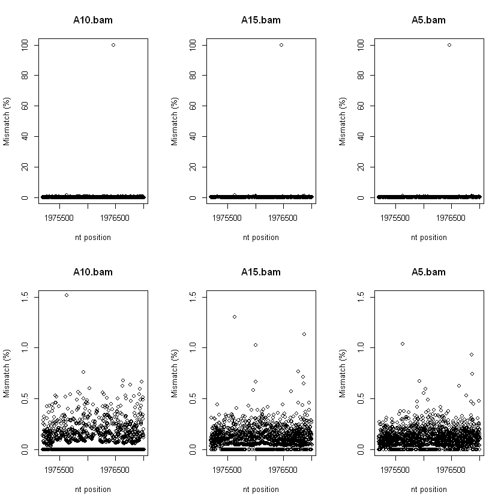
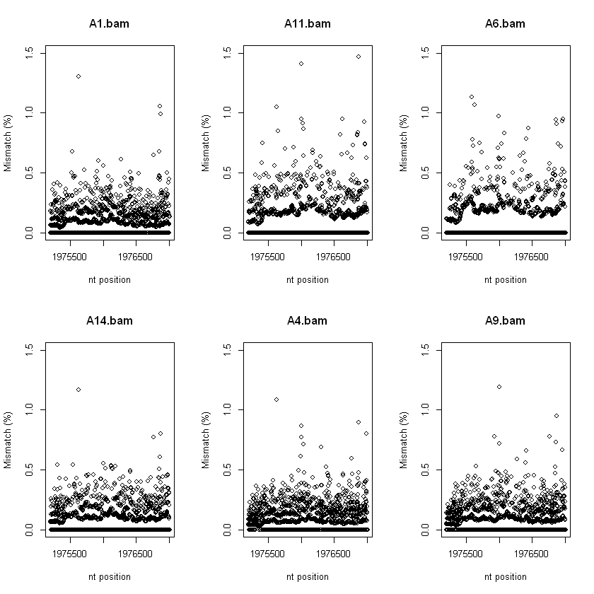

<a id="TopofEColiVariantWorkflowDoc"></a>
<h1><font color="blue">E.coli RNA seq analysis for Baker lab</font></h1>

This document contains R code workflow used to generate RNA-Seq figures for the Ridone et al manuscript. 


<b>BAM file IDs:</b>
<pre>
A1, A6, A11 -- Pots
A2, A7, A12 -- preG20V
A3, A8, A13 -- G20V
A4, A9, A14 -- preL183F
A5, A10, A15 -- L183F
</pre>

<b>Quick links to analysis within this document:</b>
<ul><li><a href="#RequiredLibrariesBakerLab2021">Libraries, functions and data sets</a></li>
    <li><a href="#visualisingE.coliGenesofInterst">Visualising genomic positions of E.coli genes of interest</a></li>
    <li><a href="#RsamtoolsPileup_E.coli_RNASeq">Code used to generate pileup data</a></li>
    <li><a href="#motBPlots">motB plots</a></li>
    <li><a href="#PomAFigures">pomA plots</a></li>
</ul>


---
<a id="RequiredLibrariesBakerLab2021"></a>
<h3><font color="brown">Required libraries, functions and data sets</font></h3>

<a href="#TopofEColiVariantWorkflowDoc">Return to top of document</a>


```R
library(Rsamtools)
library(dplyr)
library(Biostrings)
library(Gviz)

```


```R
#########################################################################################
## createMismatchDF
#' The createMismatchDF function compares a known reference sequence to that 
#' pileupData output generated from samtools or Rsamtools. 
#'
#' @param sequence : Reference sequence that is same length and strand orientation as pileupData. 
#' @param pileupData : Output generated from Rsamtools::pileup.
#' @param exclusionPos: nucleotide position not to analyse in pileupData. 
#' 
createMismatchDF <- function(sequence, pileupData, exclusionPos=NULL)
{
    # Generate tibble 
    by_nucPos <- pileupData %>% group_by(pos, nucleotide) 
   
    # byNucSummary <- by_nucPos %>% summarise(genotypes = n())
    byNucFreq <-  by_nucPos %>% summarise( total = sum(count))  # This can be used to calculat freq
    allPositions <- unique(byNucFreq$pos)
    if (length(exclusionPos) > 0)
    {   allPositions <-setdiff(allPositions,exclusionPos)  }
    
    accuracy.df <- data.frame()
    for(i in 1: length(allPositions))
    {   
     
        current_nt <- as.character(subseq(sequence, start=allPositions[i], end=allPositions[i]))
        
        idx.pos <- which(byNucFreq$pos == allPositions[i])
        
        idx.true <- which(byNucFreq$nucleotide[idx.pos] == current_nt)
        idx.false <- which(byNucFreq$nucleotide[idx.pos] != current_nt)

        thisEntry <- cbind(true=sum(byNucFreq$total[idx.pos][idx.true]),false=sum(byNucFreq$total[idx.pos][idx.false]))
        accuracy.df <- rbind(accuracy.df, thisEntry)
     
    }
    accuracy.df <- cbind(pos=allPositions, accuracy.df)
    return(accuracy.df)
}


```


```R
# Load E.coli genome
eColi.genome <- ape::read.GenBank(c('CP083410.1'),species.names = TRUE, as.character=TRUE)
eColi.genome <- DNAStringSet(paste0(eColi.genome$`CP083410.1`,collapse = ''))
names(eColi.genome) <- 'Escherichia coli strain RP437'
eColi.genome 

```


    DNAStringSet object of length 1:
          width seq                                             names               
    [1] 4641516 AGCTTTTCATTCTGACTGCAAC...AACGCCTTAGTAAGTATTTTTC Escherichia coli ...


```R
motB_region <- subseq(eColi.genome, start=1975239, end=1976284)
motB_region 
```


```R
# load in gene model
gtf_file <- "c:/Users/davhum/OneDrive - Victor Chang/references/e.coli/cp083410_1.gtf"

gtf_gr <- rtracklayer::import(gtf_file)
gtf_TxDb <- GenomicFeatures::makeTxDbFromGFF(gtf_file, format="gtf")
gtf_gr

```

---
<a id="visualisingE.coliGenesofInterst"></a>
<h3><font color="brown">Visualising genomic locations of E.coli genes of interest</font></h3>

The following code explores and demonstrates how to visualise E.coli gene model

<a href="#TopofEColiVariantWorkflowDoc">Return to top of document</a>


```R
which(gtf_gr$gene_name == "motB")
gtf_gr[6261]

print("pomA")
which(gtf_gr$gene_name == "pomA")
gtf_gr[6263]

```


<style>
.list-inline {list-style: none; margin:0; padding: 0}
.list-inline>li {display: inline-block}
.list-inline>li:not(:last-child)::after {content: "\00b7"; padding: 0 .5ex}
</style>
<ol class=list-inline><li>6261</li><li>15113</li></ol>


    GRanges object with 1 range and 10 metadata columns:
            seqnames          ranges strand |   source       type     score
               <Rle>       <IRanges>  <Rle> | <factor>   <factor> <numeric>
      [1] CP083410.1 1975326-1976228      - |  Genbank transcript        NA
              phase  transcript_id     gene_id   gene_name              oId
          <integer>    <character> <character> <character>      <character>
      [1]      <NA> TCONS_00003131 XLOC_002707        motB gene-LAJ62_09745
               tss_id exon_number
          <character> <character>
      [1]     TSS3123        <NA>
      -------
      seqinfo: 2 sequences from an unspecified genome; no seqlengths


    [1] "pomA"
    


<style>
.list-inline {list-style: none; margin:0; padding: 0}
.list-inline>li {display: inline-block}
.list-inline>li:not(:last-child)::after {content: "\00b7"; padding: 0 .5ex}
</style>
<ol class=list-inline><li>6263</li><li>15115</li></ol>


    GRanges object with 1 range and 10 metadata columns:
            seqnames          ranges strand |   source       type     score
               <Rle>       <IRanges>  <Rle> | <factor>   <factor> <numeric>
      [1] CP083410.1 1976243-1977004      - |  Genbank transcript        NA
              phase  transcript_id     gene_id   gene_name              oId
          <integer>    <character> <character> <character>      <character>
      [1]      <NA> TCONS_00003132 XLOC_002708        pomA gene-LAJ62_09750
               tss_id exon_number
          <character> <character>
      [1]     TSS3124        <NA>
      -------
      seqinfo: 2 sequences from an unspecified genome; no seqlengths


```R
# motB
chr <- 'CP083410.1'
start <- 1975239
end <- 1976284

options(ucscChromosomeNames=FALSE)

grtrack <- GeneRegionTrack(gtf_TxDb, #genome = gen,
                           transcriptAnnotation = "gene_name",
                           chromosome = chr, 
                           background.panel = "#FFFEDB",
                           background.title = "darkblue",
                           name = "motB")

gtrack <- GenomeAxisTrack()
plotTracks(list(gtrack, grtrack),from = start, to = end,fontsize=14)

```


    

    


```R
# pomA

chr <- 'CP083410.1'
start <- 1976243
end <- 1977004

options(ucscChromosomeNames=FALSE)

grtrack <- GeneRegionTrack(gtf_TxDb, #genome = gen,
                           transcriptAnnotation = "gene_name",
                           chromosome = chr, 
                           background.panel = "#FFFEDB",
                           background.title = "darkblue",
                           name = "pomA")

gtrack <- GenomeAxisTrack()
plotTracks(list(gtrack, grtrack),from = start-100, to = end+100,fontsize=14)
```


    

    


---
<a id="RsamtoolsPileup_E.coli_RNASeq"></a>
<h3><font color="brown">Using Rsamtools pileup on RNA-Seq BAM files</font></h3>

The code below shows how pileup data was generated,

<a href="#TopofEColiVariantWorkflowDoc">Return to top of document</a>


```R
fl <- list.files(path = "h:/symbolicLinks/GiannoulatouLab/dth569/Baker/HISAT2_BAMs/",pattern = "*.bam")
fl
```


<style>
.list-inline {list-style: none; margin:0; padding: 0}
.list-inline>li {display: inline-block}
.list-inline>li:not(:last-child)::after {content: "\00b7"; padding: 0 .5ex}
</style>
<ol class=list-inline><li>'A1.bam'</li><li>'A10.bam'</li><li>'A11.bam'</li><li>'A12.bam'</li><li>'A13.bam'</li><li>'A14.bam'</li><li>'A15.bam'</li><li>'A2.bam'</li><li>'A3.bam'</li><li>'A4.bam'</li><li>'A5.bam'</li><li>'A6.bam'</li><li>'A7.bam'</li><li>'A8.bam'</li><li>'A9.bam'</li></ol>


```R
# CP083410.1:1,975,239-1,976,284
motB.GR <- GRanges("CP083410.1:1975239-1976284")
motB.GR <- GRanges("NC_000914:1975239-1976284")
motB.GR

pomA.GR <- GRanges("NC_000914:1975200-1977004") # This spans both motB and pomA
pomA.GR
```


    GRanges object with 1 range and 0 metadata columns:
           seqnames          ranges strand
              <Rle>       <IRanges>  <Rle>
      [1] NC_000914 1975239-1976284      *
      -------
      seqinfo: 1 sequence from an unspecified genome; no seqlengths


    GRanges object with 1 range and 0 metadata columns:
           seqnames          ranges strand
              <Rle>       <IRanges>  <Rle>
      [1] NC_000914 1976243-1977004      *
      -------
      seqinfo: 1 sequence from an unspecified genome; no seqlengths


```R
# pileup across motB gene
setwd("h:/symbolicLinks/GiannoulatouLab/dth569/Baker/HISAT2_BAMs/")
sbp <- ScanBamParam(which=motB.GR)
motB.variants <- list()
for(i in 1:length(fl))
{
    motB.variants[[i]] <- Rsamtools::pileup(fl[i], scanBamParam=sbp, pileupParam=PileupParam(max_depth=50000))
}
length(motB.variants)

```


15


```R
# This cell demonstrates what pileup output looks like
1975239-1976284
dim(motB.variants[[1]] )
object.size(motB.variants )
names(motB.variants) <- fl
head(motB.variants[[1]])
```


-1045


<style>
.list-inline {list-style: none; margin:0; padding: 0}
.list-inline>li {display: inline-block}
.list-inline>li:not(:last-child)::after {content: "\00b7"; padding: 0 .5ex}
</style>
<ol class=list-inline><li>3107</li><li>6</li></ol>


    1133552 bytes


<table class="dataframe">
<caption>A data.frame: 6 × 6</caption>
<thead>
	<tr><th></th><th scope=col>seqnames</th><th scope=col>pos</th><th scope=col>strand</th><th scope=col>nucleotide</th><th scope=col>count</th><th scope=col>which_label</th></tr>
	<tr><th></th><th scope=col>&lt;fct&gt;</th><th scope=col>&lt;int&gt;</th><th scope=col>&lt;fct&gt;</th><th scope=col>&lt;fct&gt;</th><th scope=col>&lt;int&gt;</th><th scope=col>&lt;fct&gt;</th></tr>
</thead>
<tbody>
	<tr><th scope=row>1</th><td>NC_000914</td><td>1975239</td><td>+</td><td>A</td><td>755</td><td>NC_000914:1975239-1976284</td></tr>
	<tr><th scope=row>2</th><td>NC_000914</td><td>1975239</td><td>-</td><td>A</td><td>932</td><td>NC_000914:1975239-1976284</td></tr>
	<tr><th scope=row>3</th><td>NC_000914</td><td>1975240</td><td>+</td><td>A</td><td>  1</td><td>NC_000914:1975239-1976284</td></tr>
	<tr><th scope=row>4</th><td>NC_000914</td><td>1975240</td><td>+</td><td>G</td><td>747</td><td>NC_000914:1975239-1976284</td></tr>
	<tr><th scope=row>5</th><td>NC_000914</td><td>1975240</td><td>-</td><td>G</td><td>930</td><td>NC_000914:1975239-1976284</td></tr>
	<tr><th scope=row>6</th><td>NC_000914</td><td>1975241</td><td>+</td><td>C</td><td>748</td><td>NC_000914:1975239-1976284</td></tr>
</tbody>
</table>


```R
# pileup across pomA gene
setwd("h:/symbolicLinks/GiannoulatouLab/dth569/Baker/HISAT2_BAMs/")
sbp <- ScanBamParam(which=pomA.GR)
pomA.variants <- list()
for(i in 1:length(fl))
{
    pomA.variants[[i]] <- Rsamtools::pileup(fl[i], scanBamParam=sbp, pileupParam=PileupParam(max_depth=50000))
}
length(pomA.variants)
```


15


---
<a id="motBPlots"></a>
<h3><font color="brown">Preparing motB plots</font></h3>


<a href="#TopofEColiVariantWorkflowDoc">Return to top of document</a>


```R
load(file="c:/Users//davhum/OneDrive - Victor Chang/LargeDataSets/BAM/Giannoulatou/Baker.EColi/pileup.RData")
fl <- names(motB.variants)
fl
```


<style>
.list-inline {list-style: none; margin:0; padding: 0}
.list-inline>li {display: inline-block}
.list-inline>li:not(:last-child)::after {content: "\00b7"; padding: 0 .5ex}
</style>
<ol class=list-inline><li>'A1.bam'</li><li>'A10.bam'</li><li>'A11.bam'</li><li>'A12.bam'</li><li>'A13.bam'</li><li>'A14.bam'</li><li>'A15.bam'</li><li>'A2.bam'</li><li>'A3.bam'</li><li>'A4.bam'</li><li>'A5.bam'</li><li>'A6.bam'</li><li>'A7.bam'</li><li>'A8.bam'</li><li>'A9.bam'</li></ol>


```R

idx.pre20GV <- which(fl == "A2.bam" | fl == "A7.bam" | fl == "A12.bam")
for(i in 1:3)
{
    sampleID <- names(motB.variants)[idx.pre20GV[i]]
    sampleID
    df <-  createMismatchDF(sequence = eColi.genome,motB.variants[[idx.pre20GV[i]]])

    df$mismatchRate <- df$false/(df$false+df$true)
    range(df$mismatchRate)
    plot(df$pos,df$mismatch,main=sampleID)
}

```

    `summarise()` has grouped output by 'pos'. You can override using the `.groups` argument.
    
    `summarise()` has grouped output by 'pos'. You can override using the `.groups` argument.
    
    `summarise()` has grouped output by 'pos'. You can override using the `.groups` argument.
    
    


    

    


    

    


    

    


```R
# Plot with known variant
idx.20GV <- which(fl == "A3.bam" | fl == "A8.bam" | fl == "A13.bam")

#pdf(file = "c:/Users/davhum/OneDrive - Victor Chang/VCCRI_labs/Giannoulatou/Baker/motB.20GV.pdf",width = 7,height =6)

par(mfrow=c(2,3))  # Two rows by three columns

for(i in 1:3)
{
    sampleID <- names(motB.variants)[idx.20GV[i]]
    sampleID
    df <-  createMismatchDF(sequence = eColi.genome,motB.variants[[idx.20GV[i]]])

    df$mismatchRate <- df$false/(df$false+df$true)
    range(df$mismatchRate)
    plot(df$pos,df$mismatch*100,main=sampleID, xlab = "nt position", ylab="Mismatch (%)")

}

# Plot ignoring variant
idx.20GV <- which(fl == "A3.bam" | fl == "A8.bam" | fl == "A13.bam")

for(i in 1:3)
{
    sampleID <- names(motB.variants)[idx.20GV[i]]
    sampleID
    df <-  createMismatchDF(sequence = eColi.genome,motB.variants[[idx.20GV[i]]],
                            exclusionPos = 1976170)

    df$mismatchRate <- df$false/(df$false+df$true)
    range(df$mismatchRate)
    plot(df$pos,df$mismatch*100,main=sampleID,ylim=c(0,1.5), xlab = "nt position", ylab="Mismatch (%)")
}

#dev.off()
```

    `summarise()` has grouped output by 'pos'. You can override using the `.groups` argument.
    
    `summarise()` has grouped output by 'pos'. You can override using the `.groups` argument.
    
    `summarise()` has grouped output by 'pos'. You can override using the `.groups` argument.
    
    `summarise()` has grouped output by 'pos'. You can override using the `.groups` argument.
    
    `summarise()` has grouped output by 'pos'. You can override using the `.groups` argument.
    
    `summarise()` has grouped output by 'pos'. You can override using the `.groups` argument.
    
    


    

    


```R
# Plots on one page
#pdf(file = "c:/Users/davhum/OneDrive - Victor Chang/VCCRI_labs/Giannoulatou/Baker/motB.pre20GV_and_20GV.pdf",width = 7,height =6)

par(mfrow=c(2,3))   # Two rows by 3 columns

idx.pre20GV <- which(fl == "A2.bam" | fl == "A7.bam" | fl == "A12.bam")
for(i in 1:3)
{
    sampleID <- names(motB.variants)[idx.pre20GV[i]]
    sampleID
    df <-  createMismatchDF(sequence = eColi.genome,motB.variants[[idx.pre20GV[i]]])

    df$mismatchRate <- df$false/(df$false+df$true)
    range(df$mismatchRate)
    plot(df$pos,df$mismatch*100,main=sampleID, ylim = c(0,1.5), xlab = "nt position", ylab="Mismatch (%)")
}


idx.20GV <- which(fl == "A3.bam" | fl == "A8.bam" | fl == "A13.bam")

for(i in 1:3)
{
    sampleID <- names(motB.variants)[idx.20GV[i]]
    sampleID
    df <-  createMismatchDF(sequence = eColi.genome,motB.variants[[idx.20GV[i]]],exclusionPos = c(1976170,1975622))

    df$mismatchRate <- df$false/(df$false+df$true)
    range(df$mismatchRate)
    plot(df$pos,df$mismatch*100,main=sampleID, ylim = c(0,1.5), xlab = "nt position", ylab="Mismatch (%)")
}

#dev.off()
```

    `summarise()` has grouped output by 'pos'. You can override using the `.groups` argument.
    
    `summarise()` has grouped output by 'pos'. You can override using the `.groups` argument.
    
    `summarise()` has grouped output by 'pos'. You can override using the `.groups` argument.
    
    `summarise()` has grouped output by 'pos'. You can override using the `.groups` argument.
    
    `summarise()` has grouped output by 'pos'. You can override using the `.groups` argument.
    
    `summarise()` has grouped output by 'pos'. You can override using the `.groups` argument.
    
    


    

    


---
<a id="PomAFigures"></a>
<h3><font color="brown">Preparing pomA figures</font></h3>


<a href="#TopofEColiVariantWorkflowDoc">Return to top of document</a>


```R


load(file="c:/Users/davhum/OneDrive - Victor Chang/LargeDataSets/BAM/Giannoulatou/Baker.EColi/pomA.variants.V2.RData")

```


```R
# Plot with known variant
idx.L183F <- which(fl == "A5.bam" | fl == "A10.bam" | fl == "A15.bam")

#pdf(file = "c:/Users/davhum/OneDrive - Victor Chang/VCCRI_labs/Giannoulatou/Baker/pomA.L183F.V2.pdf",width = 7,height =6)

par(mfrow=c(2,3))  # Two rows by three columns

for(i in 1:3)
{
    sampleID <- fl[idx.L183F[i]]
    sampleID
    df <-  createMismatchDF(sequence = eColi.genome,pomA.variants[[idx.L183F[i]]])

    df$mismatchRate <- df$false/(df$false+df$true)
    range(df$mismatchRate)
    plot(df$pos,df$mismatch*100,main=sampleID, xlab = "nt position", ylab="Mismatch (%)")
}

# Plot ignoring variant
idx.L183F <- which(fl == "A5.bam" | fl == "A10.bam" | fl == "A15.bam")

for(i in 1:3)
{
    sampleID <- fl[idx.L183F[i]]
    sampleID
    df <-  createMismatchDF(sequence = eColi.genome,pomA.variants[[idx.L183F[i]]],exclusionPos = 1976458)

    df$mismatchRate <- df$false/(df$false+df$true)
    range(df$mismatchRate)
    plot(df$pos,df$mismatch*100,main=sampleID, ylim = c(0,1.5), xlab = "nt position", ylab="Mismatch (%)")
}

#dev.off()
```

    `summarise()` has grouped output by 'pos'. You can override using the `.groups` argument.
    
    `summarise()` has grouped output by 'pos'. You can override using the `.groups` argument.
    
    `summarise()` has grouped output by 'pos'. You can override using the `.groups` argument.
    
    `summarise()` has grouped output by 'pos'. You can override using the `.groups` argument.
    
    `summarise()` has grouped output by 'pos'. You can override using the `.groups` argument.
    
    `summarise()` has grouped output by 'pos'. You can override using the `.groups` argument.
    
    


    

    


```R
# pomA variants across Pots
idx.Pots <- which(fl == "A1.bam" | fl == "A6.bam" | fl == "A11.bam")

#pdf(file = "c:/Users/davhum/OneDrive - Victor Chang/VCCRI_labs/Giannoulatou/Baker/pomA.Pots.V2.pdf",width = 7,height =6)


par(mfrow=c(2,3))  # Two rows by three columns

for(i in 1:3)
{
    sampleID <- fl[idx.Pots[i]]
    sampleID
    df <-  createMismatchDF(sequence = eColi.genome,pomA.variants[[idx.Pots[i]]])

    df$mismatchRate <- df$false/(df$false+df$true)
    range(df$mismatchRate)
    plot(df$pos,df$mismatch*100,main=sampleID, ylim = c(0,1.5), xlab = "nt position", ylab="Mismatch (%)")
}

# preL183F
idx.preL183F <- which(fl == "A4.bam" | fl == "A9.bam" | fl == "A14.bam")
for(i in 1:3)
{
    sampleID <- fl[idx.preL183F[i]]
    sampleID
    df <-  createMismatchDF(sequence = eColi.genome,pomA.variants[[idx.preL183F[i]]])

    df$mismatchRate <- df$false/(df$false+df$true)
    range(df$mismatchRate)
    plot(df$pos,df$mismatch*100,main=sampleID, ylim = c(0,1.5), xlab = "nt position", ylab="Mismatch (%)")
}

#dev.off()
```

    `summarise()` has grouped output by 'pos'. You can override using the `.groups` argument.
    
    `summarise()` has grouped output by 'pos'. You can override using the `.groups` argument.
    
    `summarise()` has grouped output by 'pos'. You can override using the `.groups` argument.
    
    `summarise()` has grouped output by 'pos'. You can override using the `.groups` argument.
    
    `summarise()` has grouped output by 'pos'. You can override using the `.groups` argument.
    
    `summarise()` has grouped output by 'pos'. You can override using the `.groups` argument.
    
    


    

    


```R

```
